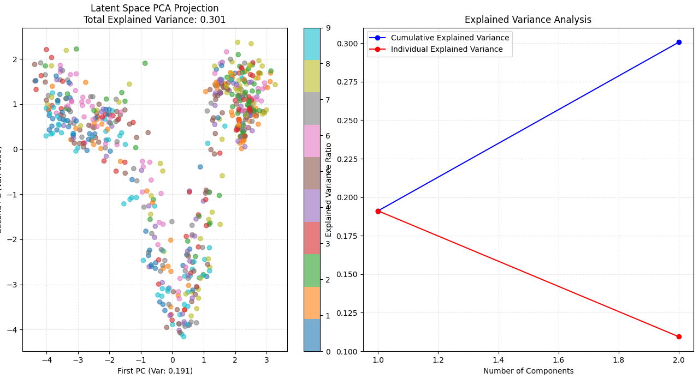

# sound-generation-via-vae
## Creating sounds via VAE, Why use a Computer Vision approach?
Well the problem lies in the fact that wav files have a depth of information so rich we cant 
just deep learning networks work. The data is way way too much to handle. For example, a single
second of wav file sampled at 44.1KHz means more than 44000 samples! That is almost a full training
dataset in one second of data, that is why we try to leverage something else. How can we squish 
that much data into a latent space for a single second? Not practical. 

That is why we convert wav files to spectrograms and use those spectrograms to create audio from
the latent space. Our simplest choice is a VAE

## How it works 

## Spectrogram and reconstruction is lossy
When we create audio from spectrograms, esp MelSpectrograms, we tend to lose the 
phase information which is important for recreating the audio. Since we are in the
log space and we care about magnitude only of the audio - we automatically lose phase
hence the reconstruction itself is lossy. 

## Latent Space Visualization

## Here is the free dataset
[Free Spoken Audio Dataset](https://github.com/Jakobovski/free-spoken-digit-dataset)
