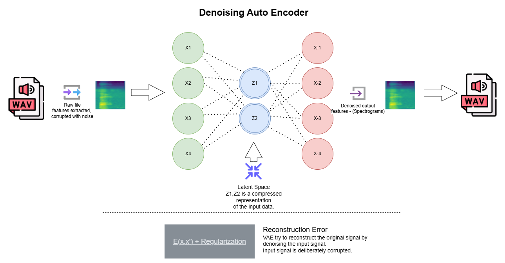

# sound-generation-via-vae
## Creating sounds via VAE, Why use a Computer Vision approach?
Well the problem lies in the fact that wav files have a depth of information so rich we cant 
just deep learning networks work. The data is way way too much to handle. For example, a single
second of wav file sampled at 44.1KHz means more than 44000 samples! That is almost a full training
dataset in one second of data, that is why we try to leverage something else. How can we squish 
that much data into a latent space for a single second? Not practical. 
That is why we convert wav files to spectrograms and use those spectrograms to create audio from
the latent space. Our simplest choice is a VAE

## Running the code
### For mnist
* Go to mnist folder
* use main.py to run the whole training and evaluation 
* This will run train/validation and a test
* Will provide plots for latent space in the end
* Make sure you have provided the correct checkpointed model
* visit the folder viz_ouput for reconstructions
### For audio dataset
* Go to free_spoken_digit
* use main.py to create select spectrogram configs and create spectrograms, 
* Select model input shape (dependent on spectrograms)
* train/test and validate model
* for validation use correct spectrogram configs and checkpointed model
* use create_audios.py to recreate audios from original spectrograms and vae generated spectrograms
* visit the following
    * viz_outputs
    * samples/generated
    * samples/original

## How it works 

## Spectrogram and reconstruction is lossy
When we create audio from spectrograms, esp MelSpectrograms, we tend to lose the 
phase information which is important for recreating the audio. Since we are in the
log space and we care about magnitude only of the audio - we automatically lose phase
hence the reconstruction itself is lossy. 

## Latent Space Visualization

## Here is the free dataset
[Free Spoken Audio Dataset](https://github.com/Jakobovski/free-spoken-digit-dataset)

## Need to understand how everything is put together?
Watch the videos by [Velario Velrado](https://www.youtube.com/watch?v=Ey8IZQl_lKs&list=PL-wATfeyAMNpEyENTc-tVH5tfLGKtSWPp)

You will find his video very important and helps you get through
* Audio Spectrograms
* Librosa
* Keras
