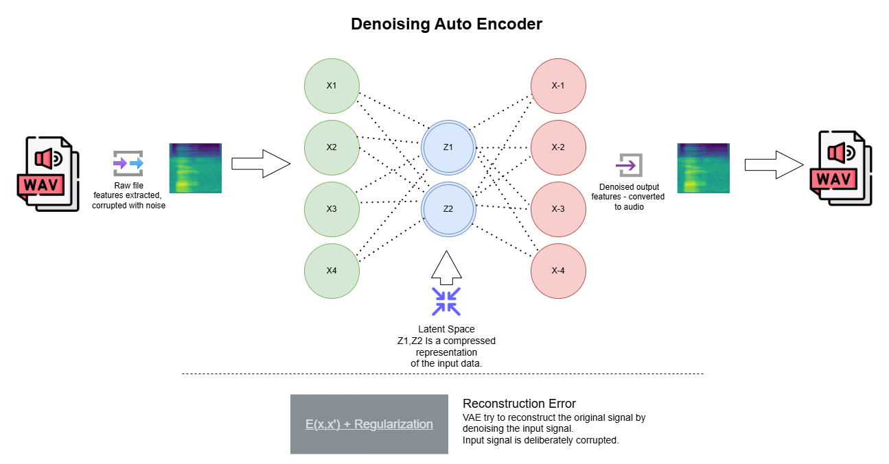

# sound-generation-via-vae
## Creating sounds via VAE, Why use a Computer Vision approach?
Well the problem lies in the fact that wav files have a depth of information so rich we cant 
let deep learning networks work. The data is way way too much to handle. For example, a single
second of wav file sampled at 44.1KHz means more than 44000 samples! How can we squish
that much data into a latent space for a single second, let alone a minute file. 
That is why we convert wav files to spectrograms and use those spectrograms to create audio from
the latent space. Our simplest choice is a VAE

